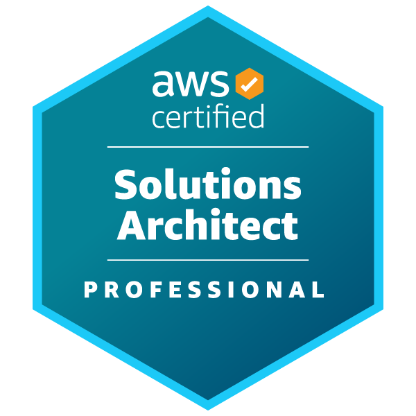

# Hey, I'm Saransh 👋

**New Grad SWE** | Backend & ML Systems | MS Data Science @ Texas A&M  
📍 Palo Alto, CA • Actively looking for opportunities

---

### 🔨 Currently Building [Jan 2026]

- **[Email-Newsletter](https://github.com/saranshagarwal202/email-newsletter)** — High-throughput, low-latency email newsletter service in Rust. Learning systems programming the hard way.

- 

---

### 💼 What I've Built

**Research @ Texas A&M** — Distributed LLM training pipelines (DeepSpeed, SLURM), reduced multimodal inference latency by 21%, built scalable benchmarking frameworks.

**@ Viewzen Labs** (2 yrs) — Architected an MLaaS platform handling 80+ concurrent training jobs, built data pipelines processing 5M+ daily events with Kafka & Docker, shipped a production prediction system.

---

### 📄 Publications

- **[SemEval-2025]** *Constrained Unlearning for LLMs* — 🥈 2nd Place, Task 4  
- **[EACL 2026]** *Adaptive Helpfulness-Harmlessness Alignment with Preference Vectors*

---

### 🛠 Stack

---

### 📫 Let's Talk

---

*Open to Backend, ML Infra, and Platform Engineering roles.*
